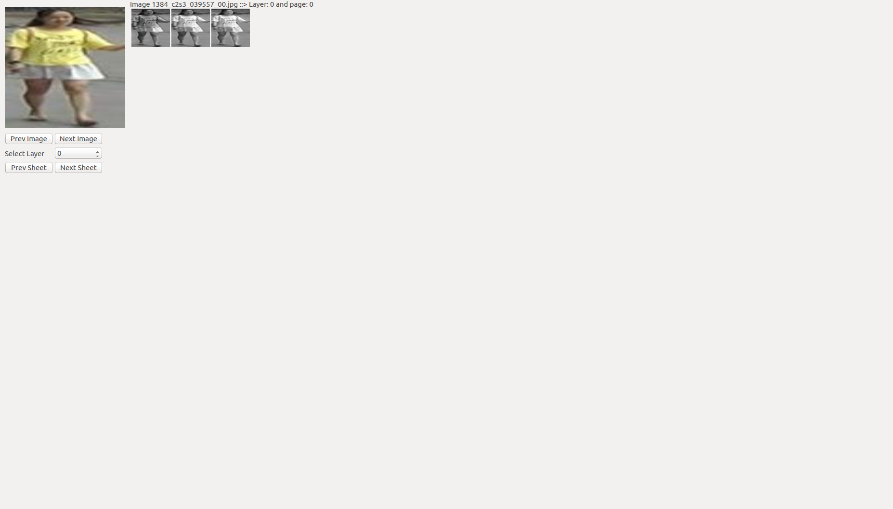
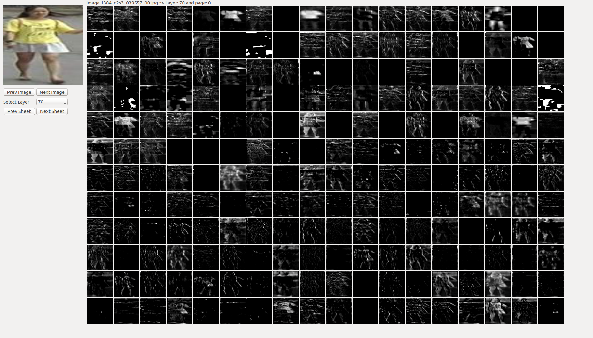
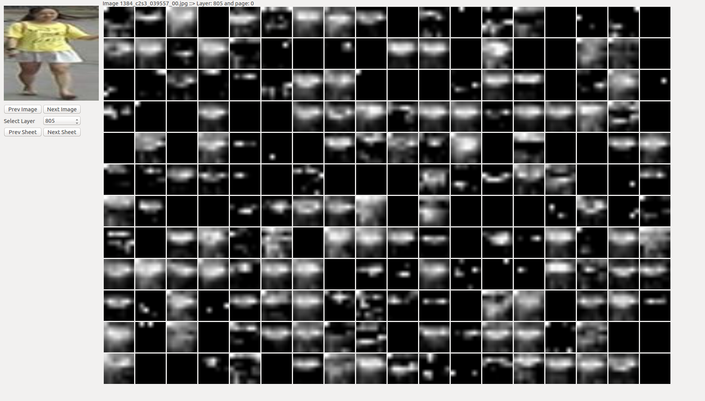

# Model Viewer

This application will show the output of each layer of a Convolution Neural Network (CNN). You can select the layer you want and the output will be shown. (If the viewing space is not enough, the images will split into pages)

Current there is only 2 models support this preview, only `Densenet161` and `ResNet50`. <br>
For `DenseNet161`, I used the code available [here](https://github.com/flyyufelix/DenseNet-Keras). You can download the model from there and test the program.

You can add custom models also. What you will need to do is adding the model file inside the `model` package, add the model details to the `lib/common.py` and add how to call your models in `libs/feature_extractor.py` file.  Also in `ui/main_window.py` file, edit the model name given to the feature extractor. <br>
**Make sure you have public `model` variable with with Keras model and `preprocess()` function in you custom model class.** (Look how I have created the `densenet` and `resnet` models for more information)

## Changing Settings
You can change the settings of the program by editing `lib/common.py` file.

| | |
|-|-|
| `image_path` variable | Location of the images. Images should be in `.jpg` format. |
| `MODEL_TYPE` class | Each model in the application has to add there. If you add a new model, create a variable here. |
| `model_locs` variable| Location of each trained `Keras Model` provided in `MODEL_TYPE` class has to list here.
| `Sizes` class | You can change the image sizes of the visualization from here.

 - `querry_x` and `querry_y`: Size of the input image shown.
 - `image_x` and `image_y`: Size of the layer outputs.
 - `n_rows`: Number of rows displayed in a single page.
 - `n_cols`: Number of columns displayed in a single page.

## Run the program

You can the the program by
```python
python main.py
```
Output shown by some layers when it was running with `DenseNet161` model is shown below.




